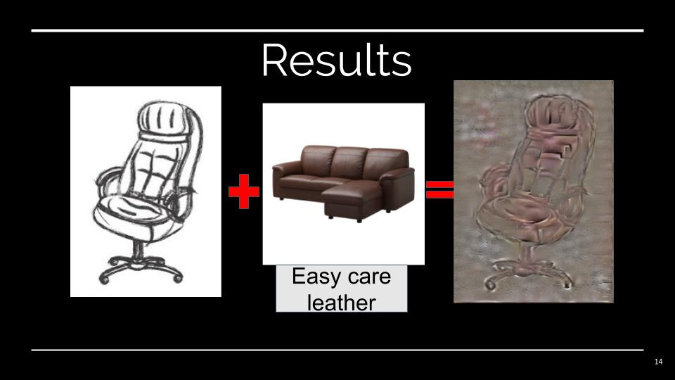
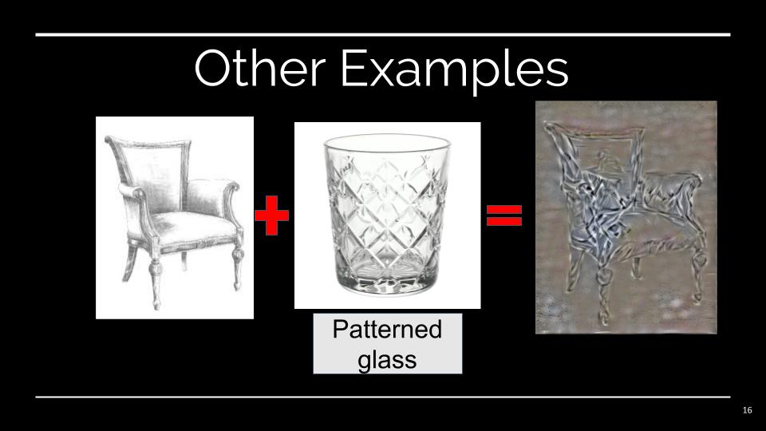
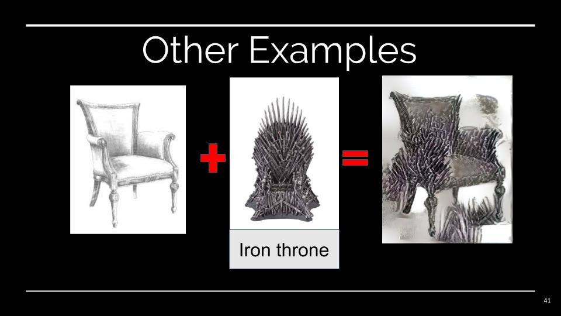
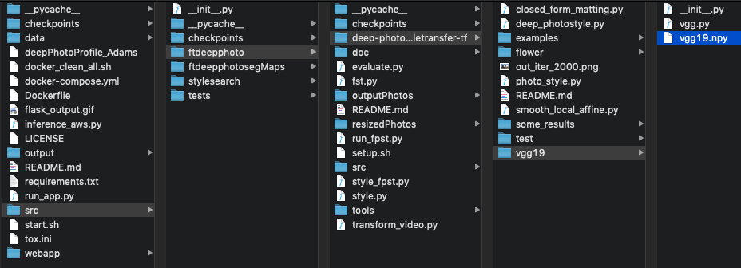
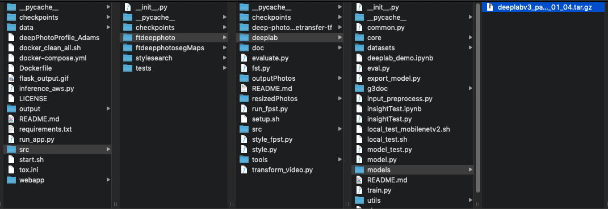
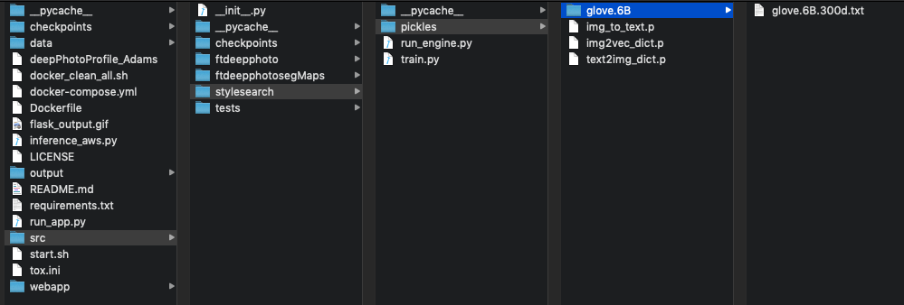

#  DeepDeco

[](https://www.python.org/) 

[](https://www.python.org/downloads/release/python-360/) [](https://opensource.org/licenses/MIT) [](https://github.com/peter0083/DeepDeco/issues/)

[](https://shields.io/)


## Motivation

Interior design is a multi-billion-dollar industry. Interior designers spend a significant amount of time during the initial consultation phase with their clients because clients often have difficulties visualizing the designers' sketches.
One AI solution to this problem to this problem is to apply neural style transfer that transfer desired pattern onto an existing photo. Neural style transfer alone, however, does not solve interior designer's problem.
Neural style transfer requires a style image that contains the desired pattern. For interior design, finding the right style images with clients will be also time-consuming.

DeepDeco generates customizable interior design images with sketches and text description. It uses neural style transfer and Word2Vec style search.

Resources: [slides](http://http://bit.ly/deepdecoppt)


## Setup

Clone repository and update python path

```
git clone https://github.com/peter0083/DeepDeco.git
cd DeepDeco
```

## Simple Usage

### via API

In a terminal, execute the following command:

```bash
curl -F "file=@data/images/chair_sketch.jpeg" -F "text='ice cold patterned glass'" -X POST http://deepdeco.club/image --output flask_output.gif
```

## Advanced Usage

### local inference 

**It is recommended to run this inference script on AWS EC2 with GPU for optimal result.**

1. setup your `awscli` credentials (required to download the dataset)
2. run 'inference_aws.py' 

```bash
python inference_aws.py --input "ice cold patterned glass" --content path/to/designer_sketch.jpg --speed "medium"
```

## Results







## Dependencies

* Python 3.6

*Deep Photo Style Transfer*

* [Tensorflow](https://www.tensorflow.org/)
* [Numpy](www.numpy.org/)
* [Pillow](https://pypi.python.org/pypi/Pillow/)
* [Scipy](https://www.scipy.org/)
* [PyCUDA](https://pypi.python.org/pypi/pycuda)

*Style Search Engine*

* [Sklearn](https://scikit-learn.org/stable/)
* [Pandas](https://pandas.pydata.org/)

*Installation*

To install the packages above, please run:

```
pip install -r requirements.txt
```

### Download the VGG-19 model weights for style transfer
The VGG-19 model of tensorflow is adopted from [VGG Tensorflow](https://github.com/machrisaa/tensorflow-vgg) with few 
modifications on the class interface. The VGG-19 model weights is stored as .npy file 
and could be download from [Google Drive](https://drive.google.com/file/d/0BxvKyd83BJjYY01PYi1XQjB5R0E/view?usp=sharing) or [BaiduYun Pan](https://pan.baidu.com/s/1o9weflK). 
After downloading, copy the weight file to the **/src/ftdeepphoto/deep-photo-styletransfer-tf/vgg19/** directory



### Download the Deep Lab V3 weights
Download DeepLab V3 weights from [DeepLabV3 Tensorflow](http://download.tensorflow.org/models/deeplabv3_pascal_train_aug_2018_01_04.tar.gz).
After downloading the file, copy the weight file to **src/ftdeepphoto/deeplab/models/** directory



### Download the GloVe 6B 300d weights
Download GloVe 6B 300d weights from [Stanford NLP group](http://nlp.stanford.edu/data/glove.6B.zip). 
Unzip the zip file and move `glove.6B.300d.txt` to the **src/stylesearch/pickles/glove.6B/** directory.



## Build Environment

```
AWS
Deep Learning AMI (Ubuntu) Version 13.0 (ami-00499ff523cc859e6)
Comes with latest binaries of deep learning frameworks pre-installed in separate virtual environments: 
MXNet, TensorFlow, Caffe, Caffe2, PyTorch, Keras, Chainer, Theano and CNTK. 
Fully-configured with NVidia CUDA, cuDNN and NCCL as well as Intel MKL-DNN
Platform: Ubuntu
Image Size: 75GB
```

## Train

1. to load different Word2Vec weights to the style search engine, run the following script:

```bash
python src/stylesearch/train.py --weight_path /path/to/your_word2vec_weight.txt
```

2. to train style transfer model with your own images, run the following script:

```bash
python src/ftdeepphoto/style_fpst.py # see arguments below
```

Remember to specify the following arguments when you run the train script.

```bash
        --style /path/to/image_style_to_transfer.jpg \
        --style-seg /path/to/style_image_segmentation_map.jpg \
        --checkpoint-dir directory_to_checkpoint/ \
        --train-path dir_to_training_images/ \
        --resized-dir dir_to_resized_training_images/ \
        --seg-dir dir_to_training_segmaps/ \
        --vgg-path vgg/imagenet-vgg-verydeep-19.mat \
        --content-weight 1.5e1 \
        --photo-weight 0.005 \
        --checkpoint-iterations 10  \
        --batch-size 1 \
        --epochs 20000 \
        --deeplab-path ../deeplab/models/deeplabv3_pascal_train_aug_2018_01_04.tar.gz \
        --matting-dir matting/
```

## Reference

1. [fast-deep-photo-style-transfer-tf](https://github.com/hyangda/fast-deep-photo-style-transfer-tf) by Handa Yang 
2. Ikea data set by Ivona Tautkute et al

```
@inproceedings{FedCSIS201756,
	author={Ivona Tautkute and Aleksandra Możejko and Wojciech Stokowiec and Tomasz Trzciński and Łukasz Brocki and Krzysztof Marasek,},
	pages={1275--1282},
	title={What Looks Good with my Sofa: Multimodal Search Engine for Interior Design},
	booktitle={Proceedings of the 2017 Federated Conference on Computer Science and Information Systems},
	year={2017},
	editor={M. Ganzha and L. Maciaszek and M. Paprzycki},
	publisher={IEEE},
	doi={10.15439/2017F56},
	url={http://dx.doi.org/10.15439/2017F56},
	volume={11},
	series={Annals of Computer Science and Information Systems}
}
```  

3. "What Looks Good with my Sofa: Multimodal Search Engine for Interior Design" 
by Ivona Tautkute, Aleksandra Możejko, Wojciech Stokowiec, Tomasz Trzciński, 
Łukasz Brocki and Krzysztof Marasek https://arxiv.org/abs/1707.06907

```
@inproceedings{FedCSIS201756,
	author={Ivona Tautkute and Aleksandra Możejko and Wojciech Stokowiec and Tomasz Trzciński and Łukasz Brocki and Krzysztof Marasek,},
	pages={1275--1282},
	title={What Looks Good with my Sofa: Multimodal Search Engine for Interior Design},
	booktitle={Proceedings of the 2017 Federated Conference on Computer Science and Information Systems},
	year={2017},
	editor={M. Ganzha and L. Maciaszek and M. Paprzycki},
	publisher={IEEE},
	doi={10.15439/2017F56},
	url={http://dx.doi.org/10.15439/2017F56},
	volume={11},
	series={Annals of Computer Science and Information Systems}
}
``` 
4. Image icon reference: https://visualpharm.com/assets/93/Chair-595b40b65ba036ed117d0825.svg

## Project Structure
The directory structure of this project is organized in the diagram below: 

```
├── LICENSE
├── README.md             <- The top-level README for developers using this project.
├── flask_output.gif      <- Sample output
├── data
│   ├── coco_stuff        <- COCO Data Set for DeepLab testing.
│   └── images            <- IKEA Data Set for training and inference.
│
├── webapp                <- Scripts for Flask API
│
├── output                <- Sample output images      
│
├── checkpoints           <- Save checkpoints during training and testing.
│
├── requirements.txt      <- The requirements file for reproducing the analysis environment
│
├── src                   <- Source code for use in this project.
│   ├── stylesearch       <- Scripts for Style Search Engine
│   │
│   ├── ftdeepphotosegMaps<- Segmented images during training and inference
│   │
│   ├── ftdeepphoto       <- Scripts for Deep Photo Style Transfer (TensorFlow)
│   │
│   ├── checkpoints       <- Save checkpoints during training and testing.
│   │
│   └── tests             <- Unit tests for pytest.
│
└── tox.ini               <- tox file with settings for running tox; see tox.testrun.org
```

## Contact

Peter Lin: peter.tingyao@gmail.com