# fast-deep-photo-style-transfer-tf

Fast Python implementation of deep photo style transfer [Luan et al., 2017](https://arxiv.org/abs/1703.07511) using a heavily modified version of [Logan Engstrom's](https://github.com/lengstrom/fast-style-transfer) implementation of fast painterly style transfer, with option to use [Louie Yang's](https://github.com/LouieYang/deep-photo-styletransfer-tf) original implementation following [Luan et al., 2017](https://arxiv.org/abs/1703.07511).

Automatic segmentation is performed in both options using [TensorFlow's DeepLabv3](https://github.com/tensorflow/models/tree/master/research/deeplab).

Typical run time for fast deep photorealistic style transfer is about 5 seconds on a CPU. The slow option produces better results, but takes about 30 minutes per image on a GPU.

To train the fast network, estimated runtime is about 1 hour per image on a GPU.

## Fast Photorealistic Style Transfer

Transfer styles of objects from one photo into another!

<p align = 'center'>
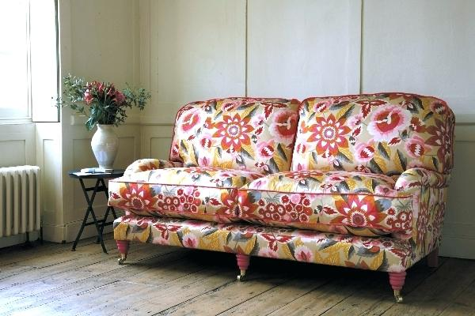
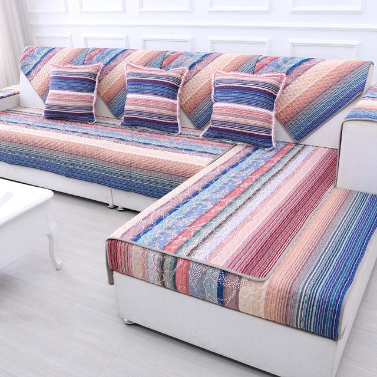
</p>

<p align = 'center'>
Example training photo on the left, with reference style photo on the right.
</p>

### Training photo examples

<p align = 'center'>

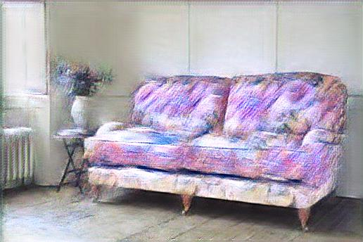
</p>
<p align = 'center'>
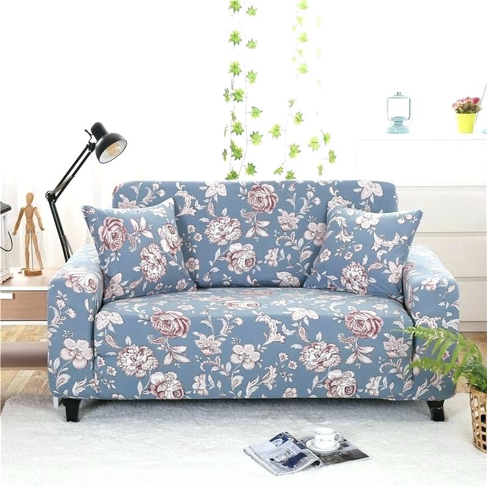
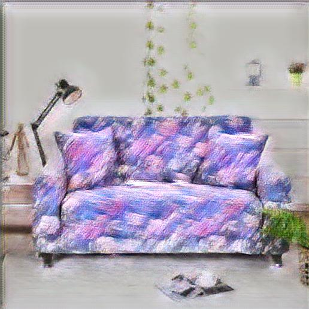
</p>
<p align = 'center'>
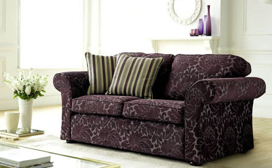
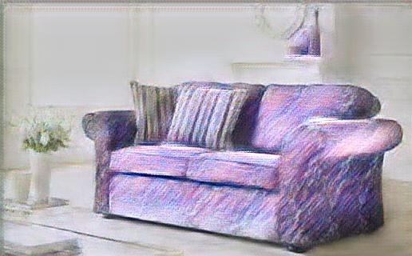
</p>

<p align = 'center'>
Example training photos on the left, with trained stylized photos on the right.
</p>

### Test photo examples

<p align = 'center'>
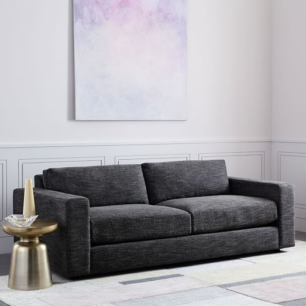
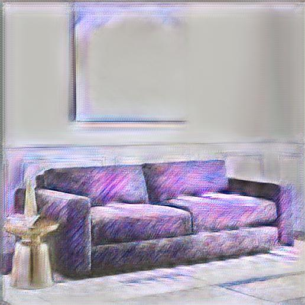
</p>
<p align = 'center'>
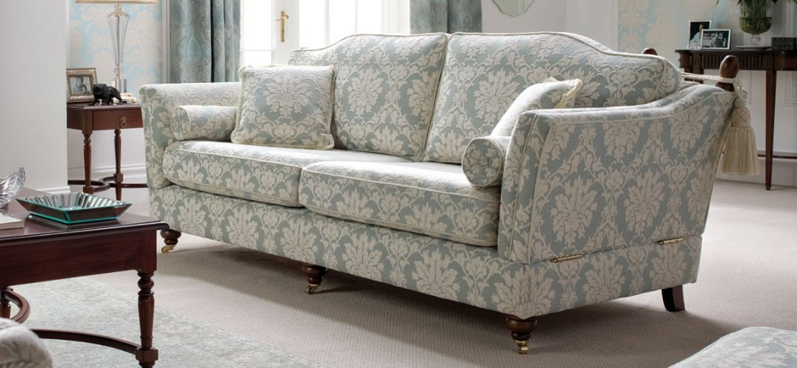
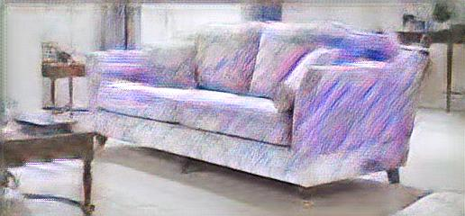
</p>
<p align = 'center'>
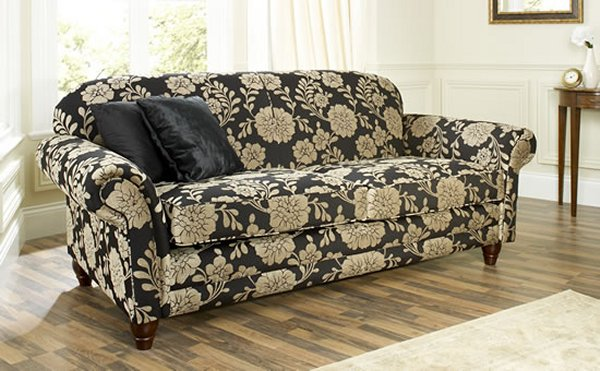
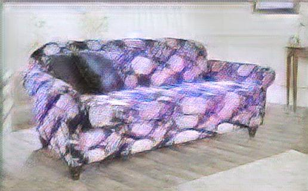
</p>

<p align = 'center'>
Example test photo the network has never seen on the left, with stylized photo on the right.
</p>

### Slow style transfer

<p align = 'center'>
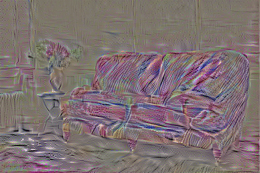
</p>

<p align = 'center'>
For reference, here is the first image pair using the slow style transfer network.
</p>

## Usage: perform photorealistic style transfer
```
python run_fpst.py --in-path original_image.jpg  --style-path image_style_to_transfer.jpg --checkpoint-path directory_to_checkpoint/ --out-path output_stylized_image.jpg --deeplab-path deeplab/models/deeplabv3_pascal_train_aug_2018_01_04.tar.gz --batch-size 1 --slow
```

`--in-path` Path to the input `original_image.jpg`.

`--style-path` Path to the reference style image which we will use to conduct the transfer `image_style_to_transfer.jpg`.

`--checkpoint-path` Path to the directory containing trained fast photorealistic style transfer checkpoint (one trained style only).

`--out-path` Output stylized image filename `output_stylized_image.jpg`.

`--deeplab-path` Path to trained DeepLabv3 checkpoint. I found the best performance using the Xception backbone pretrained on COCO + VOC, [available here](http://download.tensorflow.org/models/deeplabv3_pascal_train_aug_2018_01_04.tar.gz).

`--batch-size` Controls batch size. Default is `4`.

`--slow` Chooses [Louie Yang's deep photo style transfer algorithm](https://github.com/LouieYang/deep-photo-styletransfer-tf) as the transfer algorithm (~30 min on GPU). Default is `False`, which uses fast photorealistic style transfer network heavily modified from [Logan Engstrom's](https://github.com/lengstrom/fast-style-transfer) implementation.

## Usage: training the fast photorealistic style transfer network on your own images

```
python style_fpst.py --style image_style_to_transfer.jpg --style-seg style_image_segmentation_map.jpg --checkpoint-dir directory_to_checkpoint/ --train-path dir_to_training_images/ --resized-dir dir_to_resized_training_images/ --seg-dir dir_to_training_segmaps/ --vgg-path vgg/imagenet-vgg-verydeep-19.mat --content-weight 1.5e1 --photo-weight 0.005 --checkpoint-iterations 10  --batch-size 1 --epochs 20000 --deeplab-path ../deeplab/models/deeplabv3_pascal_train_aug_2018_01_04.tar.gz --matting-dir matting/
```

`--style` Path to the reference style image which we will use to conduct the transfer `image_style_to_transfer.jpg`.

`--style-seg` Path to the segmentation map of the style image `style_image_segmentation_map.jpg`. You should first run the slow photorealistic style transfer to check whether your style image transfers well onto one image. During that process, a segmentation map will be produced, which you can use here.

`--checkpoint-dir` Path to directory which will contain trained checkpoint (on current style only).

`--train-path` Directory containing training images. I suggest choosing 1-10 images which can easily, clearly, and accurately be segmented using DeepLabv3.

`--resized-dir` Directory containing resized training images. The images within are automatically created.

`--seg-dir` Directory containing automatically segmented training images. The images within are automatically created.

`--vgg-path` Path to VGG-19 weights. If you have not run `setup.sh`, doing so will download the correct file and place it into this path (Default).

`--content-weight` Relative importance of the content of the image when training. Default = `7.5`.

`--style-weight` Relative importance of the style of the image when training. Default = `1e2'.

`--tv-weight` Relative importance of total variation loss, designed to reduce noise. Default = `2e2`.

`--photo-weight` Relative importance of photorealistic distortion penalty term, designed to reduce distortion on edges. Default = `5e-3`.

`--checkpoint-iterations` Number of iterations before losses are printed to screen and Tensorboard, and at which the checkpoint is saved.

`--batch-size` Controls batch size. Default is `4`.

`--epochs` Total number of epochs used in training. I found somewhere between `10000` and `20000` gave the best results.

`--deeplab-path` Path to trained DeepLabv3 checkpoint. I found the best performance using the Xception backbone pretrained on COCO + VOC, [available here](http://download.tensorflow.org/models/deeplabv3_pascal_train_aug_2018_01_04.tar.gz).

`--matting-dir` Directory to store matting Laplacian matrices computed as an intermediate step. These matrices take a long time to compute (30 to 1 min per image), so if you will be using the same training images to train another style (or make a mistake in training), this saves you tremendous time as the number of training images increase.

## Requirements

This repository was tested using:
- Python 3.6
- [TensorFlow and TensorFlow GPU 1.8.0](https://anaconda.org/anaconda/tensorflow-gpu)
- [MoviePy 0.2.3.3](https://anaconda.org/conda-forge/moviepy)
- [FFmpeg 3.1.3](https://anaconda.org/conda-forge/ffmpeg)